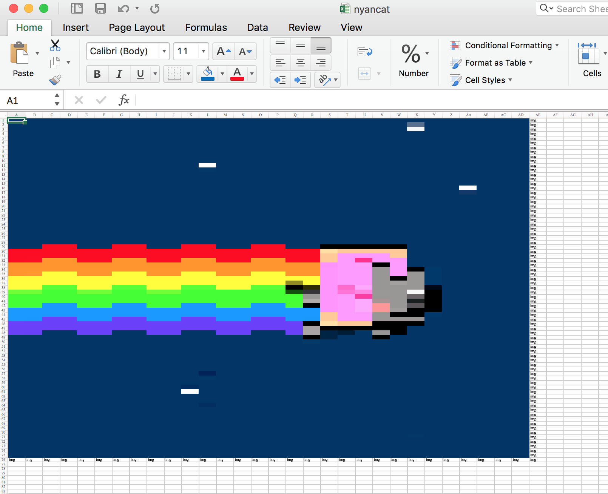
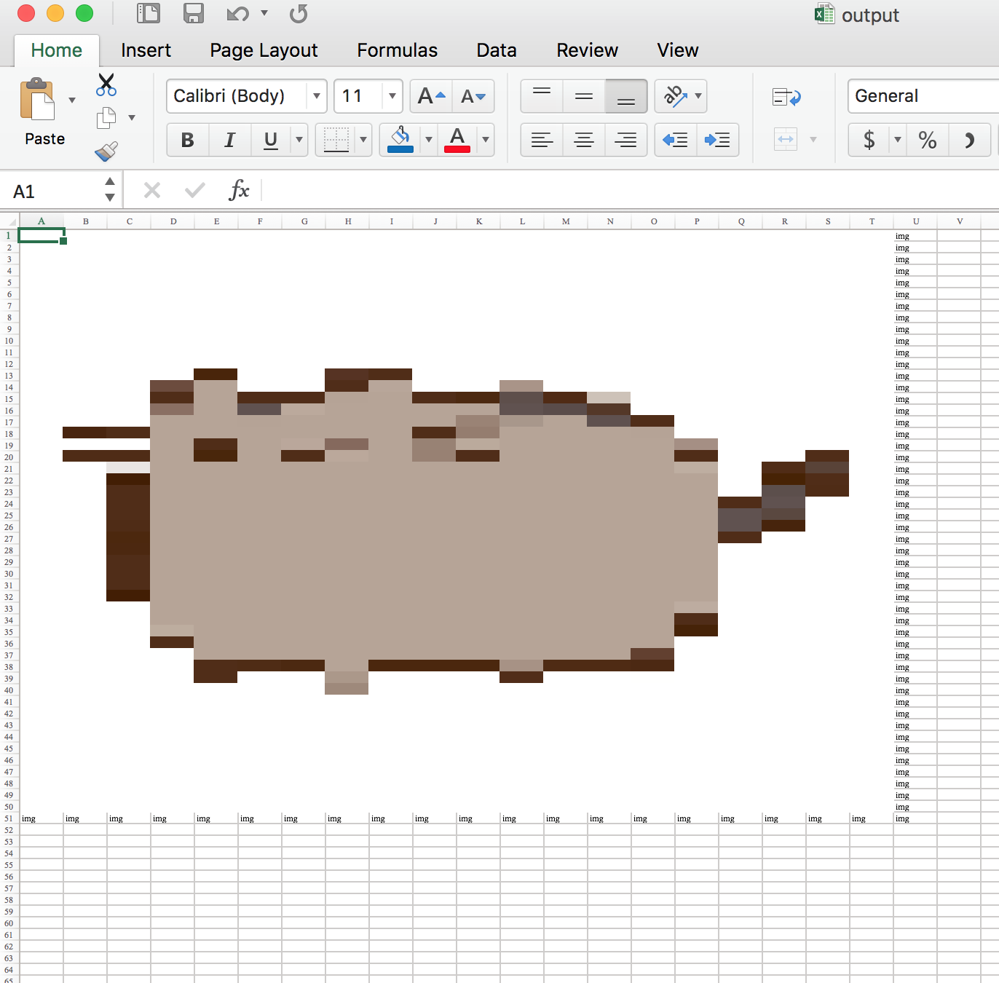
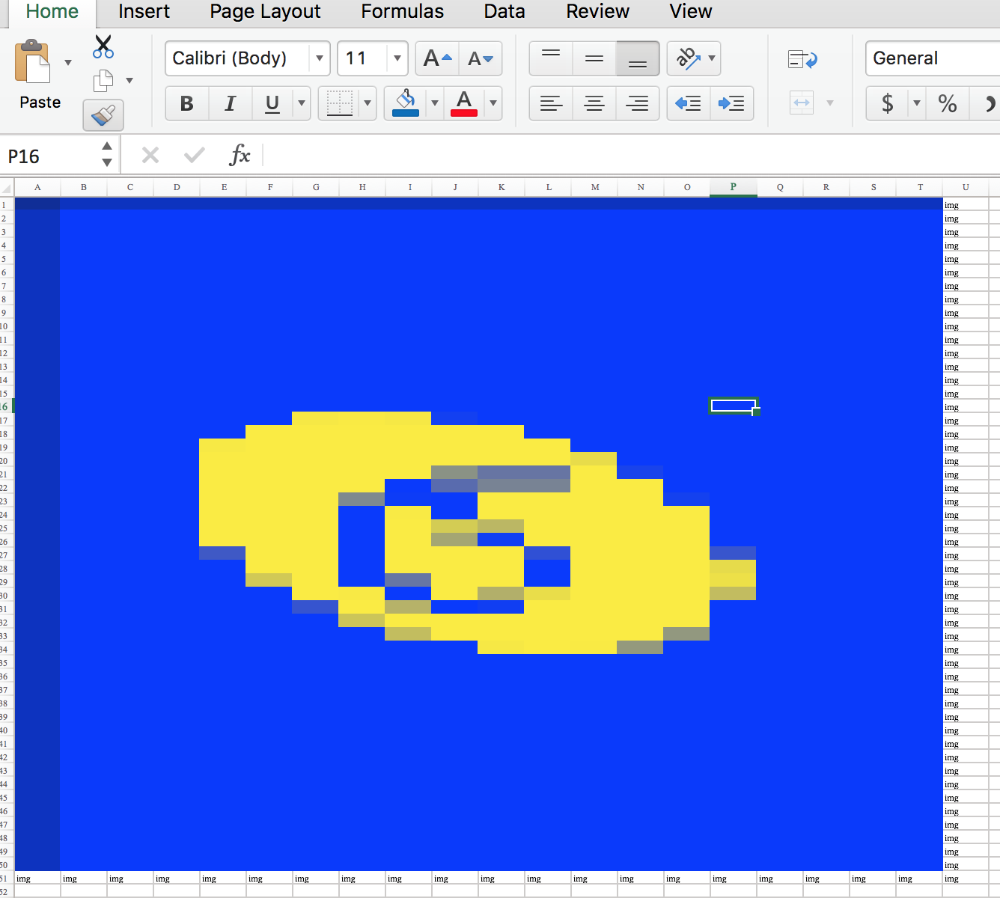

# Image to Spreadsheet

This is a little wacky python script that converts images to excel (.xlsx) spreadsheets. Not maintained, nor written with a well-thought out interface. To use, just run the python script. If in the mood for cleanup, perhaps it would be worthwhile to allow command line arguments.

Anyhow, use at your own risk. The down-sampling algorithm could use some work.

It's pretty cool.

MIT License.

## Screenshots

